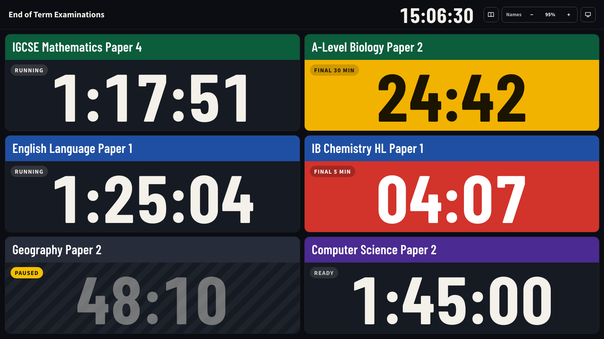
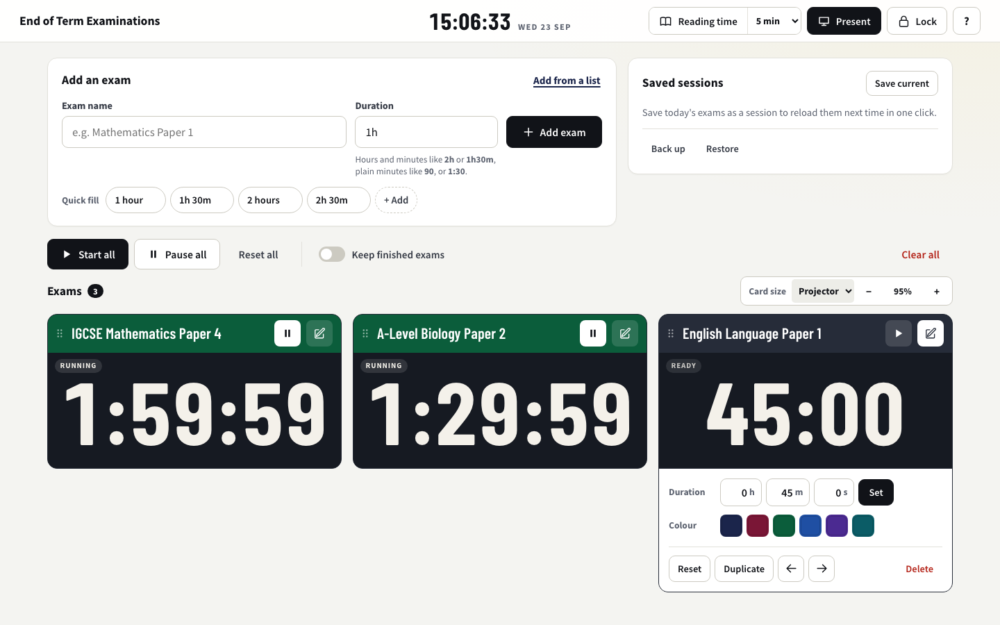
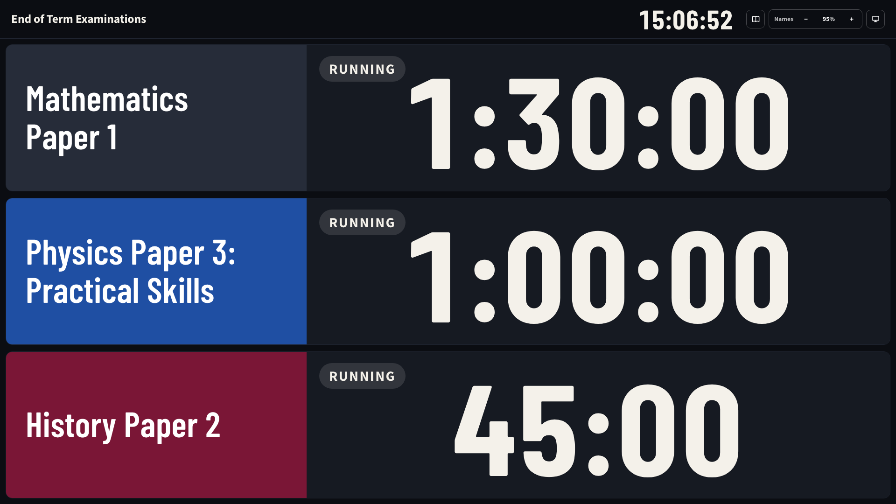
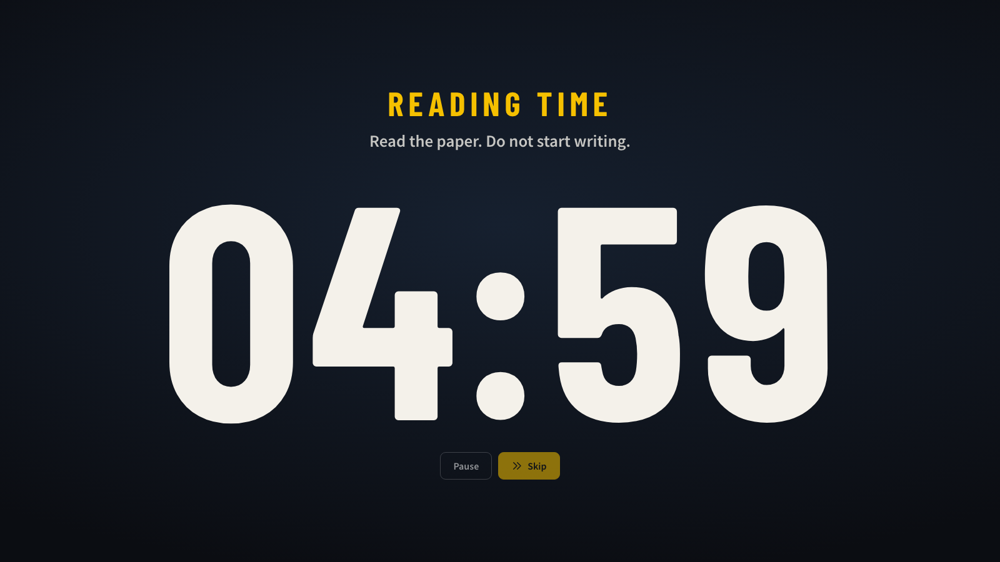

# Exam Timer

A countdown timer for exam halls, built so the student in the back row can read it.

You set up the exams on a laptop, plug into the projector, press **P**, and every paper gets its own card with the biggest numbers the screen can fit. It runs offline, it survives the laptop going to sleep, and it doesn't flash at students who are still writing.



---

## Why I built this

Our school runs several papers in the same hall at once. The timer we had on the projector looked fine on a laptop and terrible from row 20. The numbers used about half the space they had. Long paper names ("IGCSE Mathematics Extended Paper 4 (0580/42)") broke mid-word or pushed the bottom row off the screen. With six exams on a 720p projector, the digits were about 70 pixels tall, and part of the grid needed scrolling that nobody at the back could do.

So I rebuilt it around one question: *how big can the numbers get on this exact screen?*

| Setup | Before | Now |
|---|---|---|
| 6 exams, 720p projector | ~70 px digits, bottom row cut off | 169 px, everything on screen |
| 1 exam, 1080p screen | 219 px | 768 px |
| 7 exams, 1080p screen | 106 px | 187 px |
| Reading time countdown | 64 px | ~415 px, full screen |

Those numbers are measured in the browser, not estimated.

## What it does

**For the students (hall view)**
- The layout engine tries every column count for the number of exams and screen size, and picks the one that gives the biggest digits with no scrolling. With a few exams on a wide screen it switches to a departure-board layout: name on the left, time on the right.
- Digits are measured against the real box they sit in, not guessed from breakpoints.
- Under an hour shows `45:00`, not `00:45:00`. Two fewer characters means bigger digits.
- Exam names wrap on whole words, share one size across the grid, and never clip, even with descenders like g and y.
- Colour means one thing, how much time is left: amber for the final 30 minutes, red for the final 5, dark red with **TIME UP** at the end. Every state also has a text label, so it works for colour-blind students too.
- Paused exams look paused: dimmed digits, a hatched background and a yellow **PAUSED** tag.
- Nothing flashes. A finished exam changes colour and stays still, because the rest of the room is still writing.
- The real time of day stays in the top corner the whole time.

**For the teacher (setup view)**
- Type durations the way people actually type them: `2h`, `1h30m`, `2 hours`, `1.5h`, `90`, `1:30`. Anything it can't read gets an error, not a guess. (The old version turned "2 hours" into a 2-minute timer. That one was fun to find.)
- Paste a whole timetable at once, one exam per line. Names can have commas in them: `English Language, Paper 1, 2h` works.
- Quick-fill buttons for common lengths, and the duration stays filled in, so adding five 2-hour papers doesn't mean typing "2h" five times.
- Full-screen reading time (5, 10 or 15 minutes) before the exams start.
- **Lock** hides the editing controls *and* turns off the keyboard shortcuts, so a stray spacebar can't pause the whole hall.
- Save a day's exams as a session and reload it next time in one click. Back up and restore everything as a file.



<table>
  <tr>
    <td></td>
    <td></td>
  </tr>
  <tr>
    <td>Three exams on a wide screen switch to rows.</td>
    <td>Reading time fills the whole screen.</td>
  </tr>
</table>

## Quick start

**In a browser (no install).** The whole app is one HTML file plus its fonts. Serve the `app` folder and open it:

```bash
python3 -m http.server 8765 --directory app
```

Then go to `http://localhost:8765`. Opening `app/index.html` directly also works.

**As a desktop app (Electron, Windows installer).**

```bash
npm install
npm start
```

`npm run dist:win` builds a Windows installer and a portable `.exe` into `dist/`.

**As a Tauri app.** `npm run tauri:dev` runs it, `npm run tauri:build` packages it. The Windows build also runs in GitHub Actions (`.github/workflows/tauri-windows.yml`).

Everything is local: fonts, the animation library, all of it. The app works with no internet connection, which matters in exam halls that lock down Wi-Fi.

## Running an exam with it

1. Add each paper: name and duration, or **Add from a list** for the whole timetable.
2. Press **Present** (or **P**) on the projector screen.
3. If there's reading time, start it from the header.
4. **Start all** (or **Space**) when writing begins.
5. Turn on **Lock** so nobody can pause anything by accident.

Finished exams disappear 30 seconds after time is up and the rest of the cards grow to fill the space. Turn on **Keep finished exams** if you'd rather move them to a shelf at the bottom.

> **A note on exam board rules.** If your centre follows JCQ rules (UK), the exam room must have a clock showing the actual time, and JCQ's *Instructions for Conducting Examinations* say that "countdown and 'count up' clocks are not permissible" as that clock. The hall view keeps the real time in the corner, but treat this app as a support for students, not a replacement for the room clock. Other boards have their own rules, so check yours.

## Keyboard shortcuts

| Key | Does |
|---|---|
| `Space` | Start or pause all exams |
| `P` | Toggle the hall view |
| `R` | Start reading time |
| `Ctrl +` / `Ctrl -` | Card size (in the hall view: name size) |
| `Ctrl 0` | Reset size |
| `Esc` | Close dialogs, or leave the hall view |
| `?` | Open or close the help guide |

`Space`, `P` and `R` do nothing while the controls are locked.

## How it works

Everything lives in `app/index.html`: plain HTML, CSS and JavaScript, no framework and no build step.

**Timing doesn't drift.** Each running exam stores its real end time, not a number of seconds that gets counted down. The display just works out `end time - now` on every frame. If the laptop sleeps or the window gets minimised, the timer is still right when it comes back. If the system clock jumps backwards or more than 24 hours pass, affected exams pause and the app tells you, instead of showing a wrong time with confidence.

**Layout is measured, not guessed.** For the hall view, `layoutTimers()` tries every column count (and a row layout for wide cells), estimates the digit size each one allows, and keeps the winner. Then it measures the real boxes and sizes the digits to the smallest one, so every card in the grid matches. The digit font (Barlow Condensed) has fixed-width numbers, so `1:11:11` and `8:88:88` take the same space and nothing jumps as seconds tick.

**Names get fitted separately.** Every name starts at the same size. Only names that would overflow shrink, down to a floor, and past that they end with an ellipsis on a whole line. All headers in a grid share one height so the digits line up across a row.

**Motion is only for layout changes.** When an exam is added, removed or moved, the other cards slide into place ([anime.js](https://animejs.com) `createLayout`) so you don't lose track of where your exam went. Numbers and colours never animate. All of it switches off under the system's reduced-motion setting.

**Saving** uses `localStorage`, falls back to cookies, and tells you plainly if neither works.

## Tests

```bash
npm test               # unit tests (Node's built-in runner, fake clock and DOM)
npx playwright test    # browser tests (Playwright + Chromium)
```

There are 33 unit tests and 93 browser tests. The browser tests check things like:
- no scrolling in the hall view for 1 to 7 exams at 1280x720
- digits never clipped, and never smaller than a set size
- names never clipped at any zoom
- the lock blocking the shortcuts
- the duration parser rejecting "2 houses"

Layout tests run with reduced motion so they measure where cards end up, and one spec runs with animation on to check that cards settle cleanly.

## Project layout

```text
app/                 the web app (index.html, fonts, vendor/anime.umd.min.js)
main.js              Electron wrapper
timer_fixed_v2.html  copy of app/index.html used by the Electron build
src-tauri/           Tauri wrapper
tests/               unit tests, Playwright specs, reference screenshots
docs/                plans and README images
```

## Credits

- [Barlow Condensed](https://fonts.google.com/specimen/Barlow+Condensed), [Source Sans Pro](https://fonts.google.com/specimen/Source+Sans+3) and [Playfair Display](https://fonts.google.com/specimen/Playfair+Display), all under the SIL Open Font License
- [anime.js](https://animejs.com) by Julian Garnier, MIT License
- JCQ, [Instructions for Conducting Examinations](https://www.jcq.org.uk/exams-office/ice---instructions-for-conducting-examinations/), for the exam room clock rules

## Licence

MIT. See [LICENSE](LICENSE). Use it at your school, change it, share it.

The bundled fonts are under the SIL Open Font License and anime.js is MIT.

Built by [@Atzdude](https://github.com/Atzdude).
